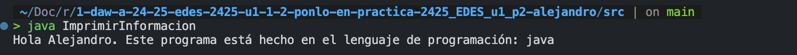
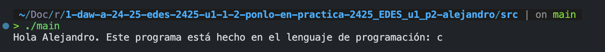
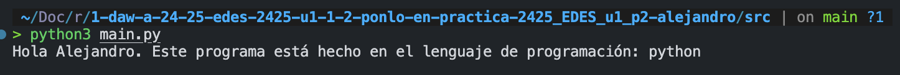
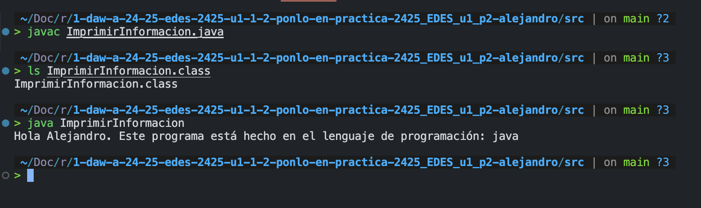
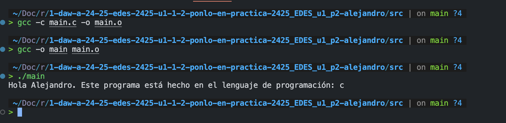

# Práctica 2: Introducción al desarrollo. Ponlo en práctica.

Apoyate en los siguientes recursos para realizar la práctica:

[Descripción de la práctica](https://revilofe.github.io/section3/u01/practica/EDES-U1.-Practica011/)

---

# Título de la Actividad

## Identificación de la Actividad

- **ID de la Actividad:** P1.2 - Ponlo en practica
- **Módulo:** EDES
- **Unidad de Trabajo:** P1.2 - Ponlo en practica
- **Fecha de Creación:** 2/05/2025
- **Fecha de Entrega:** 2/05/2025
- **Alumno(s):**
  - **Nombre y Apellidos:** Alejandro Bravo Calderón
  - **Correo electrónico:** abracal@g.educaand.es
  - **Iniciales del Alumno/Grupo:** abc

## Descripción de la Actividad

La actividad consiste en comprender el funcionamiento de los distintos lenguajes y como interactuan con el equipo en función del tipo que sea. Por ejemplo los interpretados y compilados.

Por lo que para desarrollar esta actividad se han realizado 3 códigos en los siguientes lenguajes de programación:

- Java
- Python
- C

Cada uno de los programas usados para dicha práctica usando estos lenguajes de programación lo que realiza es una muestra de información por terminal.

Ejemplo de ejecución del programa en **java**


Ejemplo de ejecución del programa en **C**


Ejemplo de ejecución del programa en **Python**


Captura del proceso de compilación del programa en java:


Captura del proceso de compilación del programa en C:


## Instrucciones de Compilación y Ejecución

1. **Requisitos Previos:**

   - python
   - java
   - jvm 23.02
   - gcc

2. **Pasos para Compilar el Código:**

   Para compilarlo en c:

   ```bash
   gcc main.c -o main
   ```

   Para compilarlo en java:

   ```bash
   javac ImprimirInformacion.java
   ```

3. **Pasos para Ejecutar el Código:**

   Para ejecutarlo en python

   ```bash
   python3 main.py
   ```

   Para ejecutarlo en java

   ```bash
   java ImprimirInformacion
   ```

   Para ejecutarlo en c

   ```bash
   ./main
   ```

## Desarrollo de la Actividad

### Descripción del Desarrollo

La actividad se ha realizando utilizando gcc para la compilación del código en el lenguaje **C**, para la compilación en java he usado **javac**. Para python al ser interpretado no he tenido que compilar ni realizar una generación de código intermedio, con python lo único que he tenido que he tenido que hacer es ejecutarlo ya que python al ser interpretado se irá compilando línea a línea mientras se ejecuta.

### Código Fuente

Código usado para imprimir la información en **C**
https://github.com/Alejandro-Bravo2/1-daw-a-24-25-edes-2425-u1-1-2-ponlo-en-practica-2425_EDES_u1_p2-alejandro/blob/856c7b12976907722fe9ad1c8ce94d5ced054716/src/main.c#L1-L6

Código usado para imprimir la información en **java**
https://github.com/Alejandro-Bravo2/1-daw-a-24-25-edes-2425-u1-1-2-ponlo-en-practica-2425_EDES_u1_p2-alejandro/blob/856c7b12976907722fe9ad1c8ce94d5ced054716/src/ImprimirInformacion.java#L1-L5

Código usado para imprimir la información en **python**
https://github.com/Alejandro-Bravo2/1-daw-a-24-25-edes-2425-u1-1-2-ponlo-en-practica-2425_EDES_u1_p2-alejandro/blob/856c7b12976907722fe9ad1c8ce94d5ced054716/src/main.py#L1-L4

## Documentación Adicional

- **Manual de Usuario:** [Enlace a la documentación del usuario, si existe]
- **Autorización de Permisos:** Verificar que el profesor tenga permisos de lectura en el repositorio para revisar el código.

## Conclusiones

He aprendido a como compilar en java y c además de haber aprendido sobre el código intermedio y código objeto. También he aprendido los distintos niveles que existen en los lenguajes de programación. He aprendido a la importancía de las máquinas virtuales para la portabilidad del código entre sistemas operativos.

# Pregunta: Describe cómo el software que has creado se ha relacionado con los componentes físicos del dispositivo (memoria RAM, procesador, periféricos, etc.) durante la ejecución de los tres lenguajes (interpretado, compilado y en máquina virtual).

El programa que he creado se relaciona con los componentes del equipo dependiendo del tipo de lenguaje que estemos usando. Aunque son todos muy parecidos.

**Intérprete**
Cuando nosotros ejecutamos un programa que es interpretado, lo que hará nuestro procesador es mandarle las instrucciones a la RAM de que se cargue en memoria una nueva tarea. Luego, el procesador buscará la primera llamada a funciones o la lógica implantada directamente del código, leyendo línea a línea. Estas líneas, en caso de ser un lenguaje con JIT, se irán guardando en memoria para que la siguiente vez que se lean no haga falta compilarlo de bytecode a código máquina de nuevo. En caso de que el programa en su lógica espere entrada de datos, entonces esperará a que el usuario escriba mediante teclado una respuesta. Si el programa también contiene partes en las que muestra la información por terminal o tiene una interfaz gráfica, también mandará los datos a ese periférico de salida para mostrar dicha información. Si en su ejecución el programa requiere de una lectura o escritura en alguna unidad de almacenamiento, este proceso lo leería el procesador y le enviaría una señal a la unidad de almacenamiento, en caso de ser de lectura, para pedirle que le diga si existe o no dicha información. En caso de que existá, le responderá que sí. En caso de ser una orden de escritura, entonces el procesador le mandaría una orden a la unidad de almacenamiento diciéndole que añada o sobreescriba dicha información con la zona de memoria que se haya usado en el programa para almacenar los datos que se quieren guardar en el fichero. La RAM irá almacenando todas las variables globales o de la función que se esté ejecutando, además del código máquina de las partes que JIT ya haya leído. Una vez se termine de ejecutar el programa, el procesador liberará la RAM y eliminará el proceso de ese programa.

**Compilado**
Lo primero que haríamos cuando es un lenguaje compilado es compilarlo usando por ejemplo gcc, en este proceso lo que se realiza es una comprobación a nivel de sintaxis, léxico y semántico. Esto lo hará el procesador ya que requiere de lógica debido a que irá revisando todo el código tokenizando todo para comprobar que esos tokens son los esperados y no hay tokens en sitios donde no debería. Por supuesto este proceso también se volcará en memoria y se liberará rápidamente. Una vez que tengamos el código objeto que sería el que contiene todo nuestro proyecto en un solo fichero y haberlo adaptado a nuestro sistema operativo y arquitectura entonces lo que quedaría sería el proceso de creación del fichero ejecutable, el código objeto aún no está enlazado por lo que el proceso de creación del ejecutable es sumamente importante además de que el código objeto de por sí no lo entiende la máquina. El ejecutable también lo podríamos crear usando gcc en caso de estar usando **C**, en el proceso de creación del ejecutable lo que se haría sería enlazar todas las bibliotecas y código necesario de forma que el ordenador lo pueda entender y ejecutar. Además de este proceso el compilador intentará adaptarlo lo mejor posible intentando optimizar el flujo del programa. Este proceso también se cargaría en RAM y sería el procesador el encargado del proceso del enlazamiento y creación del fichero. Una vez que tengamos el fichero ejecutable lo que haríamos sería ejecutarlo y esto mandaría una orden de entrada al procesador haciendo este que reserve una zona de memoria para dicho proceso, este proceso sería nuestro programa. Una vez lo haya hecho entonces el procesador cargará todo el código en memoria y lo ejecutará dependiendo de la lógica del programa. En su ejecución si nuestro programa requiere de entrada de datos entonces esperará que nosotros le mandemos dichos datos por teclado además de que si el programa contiene lógica en la que muestra la información en pantalla entonces enviará esos datos a dicho monitor. Si el programa en algún momento requiere de leer información de la unidad de almacenamiento, entonces el procesador le enviaría una señal a la unidad de almacenamiento accediendo a que esta busque en sus datos dicha información y le responda con una respuesta dependiendo de si la ha encontrado o no. En caso de haberla encontrado, le enviará al programa dicha información. Los lenguajes como **C** permiten reservar tus zonas de memoria o acceder a punteros, por lo que en la ejecución de nuestro programa estaríamos también guardando todas las variables en zonas de memoria. En antiguas versiones de C, las zonas de memoria reservadas, si no se liberaban en la ejecución del programa, entonces no se liberarían hasta reiniciar el dispositivo, pero eso fue corregido ahora: cuando el proceso padre termina (el programa), entonces todas las variables o datos almacenados en RAM se eliminarían. Cuando nosotros terminamos de ejecutar el programa, el procesador eliminará ese proceso de la RAM.

**Máquina virtual**
Cuando nosotros ejecutamos un programa que requiera de máquina virtual, ejemplo Java, lo primero que se hace es la creación del código intermedio. Este código intermedio lo que contiene es todo nuestro programa, además de su lógica y listo para mandárselo a la máquina virtual para ejecutarlo. Pero en el proceso de dicho código intermedio se realizan diferentes tipos de análisis para verificar si el código contiene errores sintácticos. Estos análisis son:

- Análisis léxico
- Análisis sintáctico
- Análisis semántico
  Todo este proceso lo haría el procesador y cargando el proceso en RAM. Una vez se haya terminado de revisar todo el programa, entonces lo que se haría es la generación de código intermedio que lo haría el procesador junto con la RAM para poder ir almacenando la información y, por supuesto, irá cargando nuestro proyecto en RAM para poder ir trabajando con él para dicha generación de código intermedio. Una vez que tengamos el código intermedio, entonces ya podríamos ejecutar nuestro programa. Esto lo que haríamos es, una vez se ejecute la máquina virtual, crearía como una zona virtual reservada para dicho programa. En esta zona virtual reservada, lo que se hace es controlar todo lo que vaya ocurriendo en el programa, impidiendo errores como stack overflow, ya que es la máquina virtual la que lo controla. De esta forma, se evitan vulnerabilidades relacionadas con acceder a zonas de memoria. Pero lo más importante es que la máquina virtual será la encargada de cojer ese código intermedio y adaptarlo a nuestro sistema operativo y arquitectura, optimizando su flujo lo mejor posible. Este proceso, por supuesto, estaría cargado en RAM y sería el procesador el encargado de ordenar y ejecutar todo. Una vez la máquina virtual haya terminado ese proceso, entonces se ejecutaría el programa. El programa se cargaría en RAM y sería el procesador el encargado de todas las operaciones. En caso de que nuestro programa requiera de entrada de datos, entonces la máquina virtual le enviará una alerta al procesador diciéndole que espera una entrada de datos por un periférico de entrada. Ocurriría lo mismo en caso de que se esperase una salida de datos. La única diferencia sería que, en vez de esperarse por un periférico de entrada, se enviaría a un periférico de salida como un monitor. Si en su ejecución el programa requiere de acceder a datos, entonces le enviaría una señal al procesador de que requiere de dicha información. El procesador le enviaría una orden a la unidad de almacenamiento. La unidad de almacenamiento buscaría el clúster en el que se almacena dicha información pedida y le enviaría una señal al procesador de que ya lo ha encontrado. Una vez esto ocurra, el procesador guardaría en RAM la información de la unidad de almacenamiento y le respondería a la máquina virtual con la información. Durante la ejecución del programa, todas las variables se estarían cargando en memoria, pero sería la máquina virtual la encargada de saber y conocer las posiciones de dichas variables. La máquina virtual estaría controlando el programa y enviándole las órdenes al procesador de qué realizar. Una vez todo el programa haya terminado, entonces la máquina virtual se comunicaría con el procesador diciéndole que limpiase todas las zonas de memoria del proceso padre de dicho programa. Una vez el procesador lo haga, entonces nuestro programa habría finalizado.

# Explica cómo el código fuente que escribiste se transformó en código objeto y ejecutable en el caso de los lenguajes compilados. ¿Generaste archivos intermedios (código objeto)? ¿Qué nombres tomaron estos archivos?

El código fuente que escribí se transformó en código objeto pasando por un proceso de análisis en el que se comprueba si el código tiene errores sintácticos. Una vez ese proceso haya terminado y haya dado como resulado que no tiene errores entonces se generaría un archivo que contiene el código objeto. Este código objeto tomó el nombre del fichero anteriormente pero cambiandole la extensión a .o, Si bien es cierto que se le puedo especificar que nombre quieres ponerle al fichero objeto usando el parámetor -o.

En el proceso de transformarlo a ejecutable lo que se realizó es con el comando gcc -o main main.o es un fichero ejecutable que tras el proceso de enlazado para que todo el programa funcione correctamente y haciendo uso de las bibliotecas en caso de que las hayamos usado. Entonces se crearía el fichero que contendría las instrucciones en código máquina listas para ser ejecutadas. El nombre de dicho archivo fue el mismo del fichero objeto.

# Para los lenguajes interpretados, describe cómo el código fuente se ejecutó directamente, sin generar archivos de código objeto o ejecutable.

Para los lenguajes interpretados el código fuente se ejecuta directamente sin generar archivos de código objeto o ejecutable. El intérprete lee el código fuente, lo compila a bytecode en memoria, y este bytecode es interpretado por la máquina virtual de Python permitiendo la ejecución del programa. Por lo que los lenguajes interpretados no requieren de generación de ficheros para su ejecución.

# Para el lenguaje que genera código intermedio (Java, C#), explica cómo el código fuente se transformó en código intermedio (bytecode) y cómo este fue ejecutado por la máquina virtual.

Para estos lenguajes que hacen uso de código intermedio lo que se realiza son dos fases la primera fase es la fase de compilación a código intermedio que hacen uso de compiladores como javac, dentro de esta fase se realizán comprobaciónes a nivel sintáctico comprobando y analizando si tiene errores léxicos, semánticos o sintácticos. Una vez haya finalizado este proceso y haya dado como resultado que todo está correcto entonces se genera un archivo de código intermedio que lo que contiene es toda la lógica de nuestro programa además de haberle agregado una capa de optimización para que funcione mejor. Una vez finalizado se generará un archivo intermedio normalmente bytecode que contiene toda nuestro proyecto. Para la siguiente fase que sería la de ejecución lo que se realiza es una llamada a la máquina virtual usando como parámetro el archivo que contiene el código intermedio y la máquian virtual lo leerá y lo adaptará al sistema operativo y arquitectura del equipo y procederá a ejecutarlo.

# Describe el proceso de generación de código intermedio (bytecode) en el lenguaje que utilizaste que emplea una máquina virtual (por ejemplo, Java o C#).

Para el tema de la generación de código intermedio (bytecode) en lenguajes que usan máquina virtual, por ejemplo Java, el proceso va básicamente en dos fases. Primero, tú escribes el código fuente normal en Java (el típico .java), y luego, cuando le das a compilar con el javac, lo que hace el compilador es analizar todo tu código: revisa que no tengas errores léxicos, sintácticos ni semánticos, y si todo está bien, te genera un archivo .class. Ese archivo no es código máquina, sino lo que se llama bytecode, que es como un lenguaje intermedio.

Ese bytecode tiene toda la lógica de tu programa, pero en un formato que no está pensado para una máquina concreta, sino para que lo entienda la máquina virtual de Java (la JVM). La ventaja de esto es que ese archivo .class lo puedes ejecutar en cualquier sistema operativo que tenga una JVM compatible con sus sistema operativo.

Ya en la segunda fase, cuando ejecutas tu programa, lo que haces es pasarle ese archivo de bytecode a la JVM. La máquina virtual lee el bytecode y lo va traduciendo a código máquina real, adaptado al sistema operativo y la arquitectura donde estés ejecutando el programa.

# Explica qué rol juega la máquina virtual en la ejecución del código y cómo difiere de la ejecución directa en un sistema operativo como ocurre con los lenguajes compilados e interpretados.

La máquina virtual es una capa que se pone entre tu programa y el sistema operativo. Su función es traducir el bytecode (código intermedio) a instrucciones que entiende el sistema operativo y el procesador donde estés ejecutando el programa. De esta forma nos permite que podamos ejecutar el programa.

Es distinto a los lenguajes interpretados puros, ya que el intérprete lee y ejecuta el código fuente directamente, pero sin esa capa de portabilidad que da la máquina virtual.

En resumen:
La máquina virtual permite que tu programa sea portable y se ejecute igual en cualquier sistema, mientras que los compilados van directos al sistema operativo y los interpretados dependen del intérprete instalado.

# Clasifica los tres lenguajes utilizados (interpretado, compilado y en máquina virtual) según su:

- Modo de ejecución:

1.  Compilado es el más rápido por lo que su ejecución es la más rápida ya que va directamente al sistema operativo
2.  Máquina virtual es el segundo más rapido ya que como debe de pasar por una máquina virtual para todas sus instrucciones sigue siendo menos rápida que las instrucciones directamente al procesador pero es más rápido que el interpretado
3.  Interpretaado este es el más lento ya que como debe de ir lína a línea y interpretando cada línea por el interprete entonces es mucho menos rápido que los demás.

- Nivel de abstracción
- Compilados: Su nivel de abstracción es bajo ya que la mayoría interactuan con componentes del sistema como podrían ser zonas de memoria o punteros.
- Máquina virtual: Su nivel de abstracción es alto ya que al hacer uso de la máquina virtual los programadores no requieren de la lógica de como se almacenan la información ni como se relaciona ya que ese proceso se encarga la máquina virtual.
- Interpretados: Su nivel de abstracción es alto ya que al usar un interprete permite que los programadores no tengan que encargarse de componentes del sistema, haciendolo mucho más sencillo.
- Paradigma de programación (imperativo, orientado a objetos, funcional).
- Compilados: La mayoría de lenguajes compilados utilizan paradigma imperativo ya que al hacer uso de componentes del sistemas se utiliza el imperativo porque son como instrucciones.
- Máquina virtual: La mayoría utiliza orientado a objetos devido a que orientado objetos permite un mejor mantenimiento.
- Interpretados: La mayoría utiliza funcional aunque también suelen ser orientado a objetos.

### Explica qué características de estos lenguajes influyeron en su clasificación.

Las características que influyeron fueron:

- Su modo de ejecución
- Su nivel de abstracción

# Para cada uno de los tres lenguajes (interpretado, compilado y en máquina virtual), describe las herramientas que utilizaste en el proceso de desarrollo:

**MÁQUINA VIRTUAL**
Sistema operativo (¿en qué sistema ejecutaste el programa?).

Utilizé el sistema operativo MacOS.

Editor de texto o IDE (¿dónde escribiste el código?).

Usé el editor de texto VScode.

Compilador o intérprete (¿cómo se transformó o ejecutó el código?).

Se transformó a código intermedio haciendo uso de un compilador.

Depurador (si lo usaste, ¿cómo lo empleaste para encontrar errores?).

No lo usé.

Sistema de gestión de versiones (si lo usaste, ¿cómo guardaste las versiones del código?).

Usé git y lo usé para guardar las versiones funcionales del código aunque solo guarde una versión ya que el programa contiene poca lógica y no requería de muchas versiones.

**INTERPRETADO**
Sistema operativo (¿en qué sistema ejecutaste el programa?).

Utilizé el sistema operativo MacOS.

Editor de texto o IDE (¿dónde escribiste el código?).

Usé el editor de texto VScode.

Compilador o intérprete (¿cómo se transformó o ejecutó el código?).

Se ejecutó haciendo uso del interprete de python.

Depurador (si lo usaste, ¿cómo lo empleaste para encontrar errores?).

No lo usé. Aunque para usarlo podría usar la librería de pdb.

Sistema de gestión de versiones (si lo usaste, ¿cómo guardaste las versiones del código?).

Usé git y lo usé para guardar las versiones funcionales del código aunque solo guarde una versión ya que el programa contiene poca lógica y no requería de muchas versiones.

**COMPILADO**
Sistema operativo (¿en qué sistema ejecutaste el programa?).

Utilizé el sistema operativo MacOS.

Editor de texto o IDE (¿dónde escribiste el código?).

Usé el editor de texto VScode.

Compilador o intérprete (¿cómo se transformó o ejecutó el código?).

Se transformó a código objeto haciendo uso de un compilador GCC

Depurador (si lo usaste, ¿cómo lo empleaste para encontrar errores?).

No lo usé. Pero si quisiera usarlo podría usar gdb.

Sistema de gestión de versiones (si lo usaste, ¿cómo guardaste las versiones del código?).

Usé git y lo usé para guardar las versiones funcionales del código aunque solo guarde una versión ya que el programa contiene poca lógica y no requería de muchas versiones.

## Referencias y Fuentes

https://revilofe.github.io/section3/u01/teoria/EDES-U1.5.-Lenguajes/?h=gcc#211-lenguajes-compilados

https://stackoverflow.com/questions/24819206/using-gcc-to-compile-c-code

https://stackoverflow.com/questions/2279451/how-to-compile-a-java-file-in-java

### Notas Adicionales:

1. **Nombres de Archivos y Repositorios:**
   - Asegúrate de que el nombre del archivo o repositorio siga la estructura definida: `XXX-idActividad-Iniciales`.
2. **Permisos:**
   - Verifica que el profesor tenga los permisos necesarios para acceder al repositorio o documento.
3. **Formato:**
   - Si se entrega en formato PDF o Google Docs, asegúrate de cumplir con el mínimo y máximo de folios establecidos.
4. **Compilación y Ejecución:**
   - Detalla claramente cómo compilar y ejecutar el código, incluyendo las instrucciones en el archivo `README.md`.
